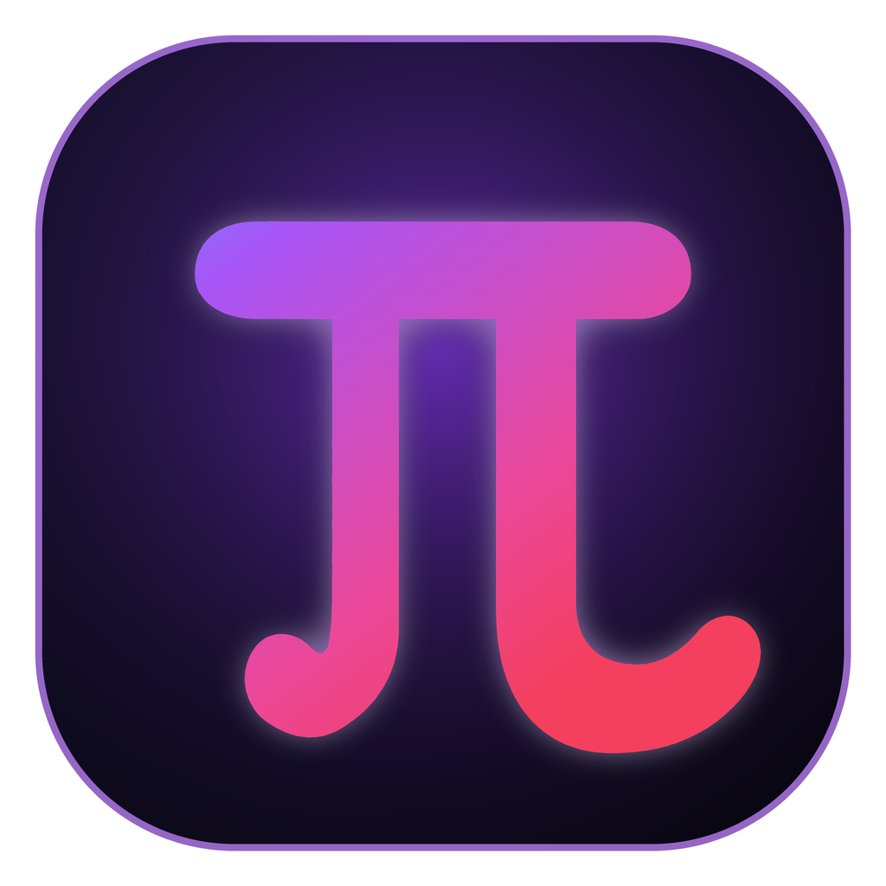

# Pi-a — 你的本地 AI 超能力桌面工作台

<p align="center">
  
</p>

<p align="center">
  <b>极简 · 高效 · 本地优先 · 真正能动手干活的桌面 AI 智能体</b>
</p>

---

## 📖 简介

**Pi-a** 是一款基于 **Pi Agent 引擎** 与 **Deno Desktop** 打造的现代 AI 原生桌面工作台。

它将大语言模型的智能与本地操作系统的底层能力（文件系统、终端指令、文档读写、浏览器自动化、专业技能扩展）深度结合，为用户提供一个高颜值、强安全、不绑定特定生态的个人 AI 助理。

---

## ✨ 核心特性

- 🎨 **极客湛蓝视觉设计**：基于现代 Web 规范与专属 Design Tokens，提供高保真暗色/亮色双主题与极致微交互体验。
- ⚡ **本地场景 Prompt 引擎**：预置日常办公、代码开发、设计创意等高频场景卡片，一键启动专业 AI 工作流。
- 🤖 **自由多模型驱动**：原生覆盖 DeepSeek (V4/Flash)、Kimi / Moonshot、MiniMax、智谱 GLM 等主流模型，支持自由切换。
- 🛠️ **深度 OS 自动化与工具箱**：
  - **终端与脚本**：智能放行安全命令，支持复杂任务自动化与多步推演。
  - **文档处理引擎**：原生读写与编辑 Word (`.docx`)、Excel (`.xlsx`)、PPT (`.pptx`) 及 PDF。
  - **浏览器自动化 (`ego-browser`)**：基于独立的 Chromium 环境进行网页自动化操作、数据提取与截图。
  - **高级 PPT 制作 (`ppt-generator-pro`)**：AI 自动生成高保真 PPT 图片与转场演示。
- 🛡️ **分级安全与权限防护**：
  - **默认权限**：只读操作自动放行，敏感写操作与命令需弹窗授权。
  - **完全访问**：常用指令自动执行，高危系统命令安全拦截。

---

## 🏗️ 技术架构

```
┌─────────────────────────────────────────────────────────────┐
│                       Pi-a 架构图                           │
├──────────────────────────────┬──────────────────────────────┤
│  前端层 (React + TypeScript) │  后端与 Agent 层 (Deno)      │
│  · 蔚蓝现代 UI / 响应式布局  │  · Pi Agent 核心引擎         │
│  · 场景 Prompt 网格卡片      │  · In-Process 嵌入式绑定      │
│  · 流式 Markdown & 工具展开  │  · 权限审批与安全沙箱        │
├──────────────────────────────┴──────────────────────────────┤
│                     本地引擎与扩展接口                      │
│  · 浏览器自动化 (ego-browser)   · PPT/Doc 文档处理引擎     │
│  · 快捷技能标签 (SKILL.md)       · MCP Protocol 协议支持    │
└─────────────────────────────────────────────────────────────┘
```

### 技术栈选型

| 模块 | 技术选型 | 说明 |
| :--- | :--- | :--- |
| **桌面运行时** | **Deno Desktop** | In-process 零往返通信，高效轻量 |
| **Agent 内核** | **Pi Agent** (`@earendil-works/pi-agent-core` / `pi-ai`) | 极简可靠、多模型原生覆盖 |
| **前端界面** | **React + Vite + TypeScript** | 组件化架构、自定义 CSS Token 设计系统 |
| **文档处理** | **JS 原生引擎** (`docx`, `exceljs`, `pptxgenjs`, `pdfjs-dist`) | 本地解析与生成 Word / Excel / PPT / PDF |
| **样式与图标** | **Vanilla CSS + Lucide Icons** | 极简无依赖、极致性能 |

---

## 🛠️ 本地开发与构建

### 1. 环境准备
- 安装 [Deno](https://deno.com/) (>= 1.40)
- 安装 [Node.js](https://nodejs.org/) (>= 18) 与 `npm`

### 2. 开发运行

```bash
# 1. 克隆项目
git clone https://github.com/hfyydd/pi-a.git
cd pi-a

# 2. 启动前端开发服务
cd frontend
npm install
npm run dev

# 3. 在根目录下启动后端代理
deno task dev
```

### 3. 应用构建与打包

```bash
# 一键编译前端、导出嵌入式资源并构建桌面应用 bundle (Pi-a.app)
deno task build
```

---

## 📂 项目目录结构

```
pi-a/
├── frontend/               # React 前端工程
│   ├── src/
│   │   ├── components/     # UI 组件 (ChatArea, Composer, Sidebar, ArtifactPanel 等)
│   │   ├── store/          # Zustand 状态管理与 Design Tokens
│   │   └── utils/          # 国际化与工具函数
│   └── public/             # 静态资源与图标
├── src/                    # Deno 后端核心
│   ├── agent/              # Pi Agent 引擎封装、工具注册与权限校验
│   ├── domains/            # 各业务领域模块 (Doc, Memory, Automation 等)
│   └── ui/                 # 嵌入式前端资源定义
├── scripts/                # 编译与图标生成自动化脚本
├── resources/              # 应用图标与资源文件
├── main.ts                 # Deno 主程序入口
└── deno.json               # Deno 任务与依赖导入表
```

---

## 📜 许可协议

[MIT License](./LICENSE)
